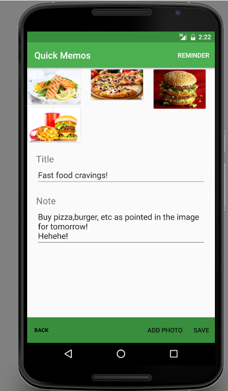
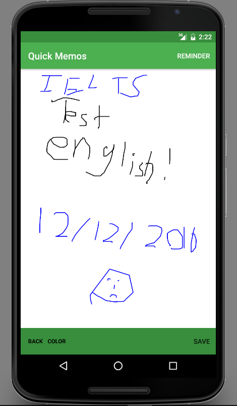
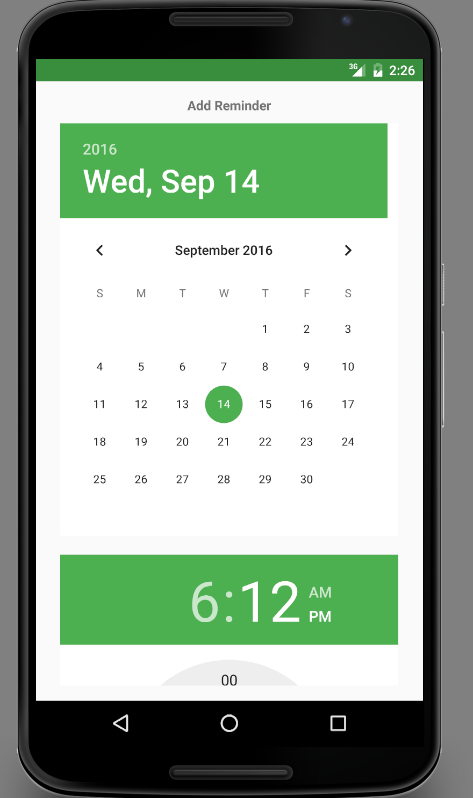
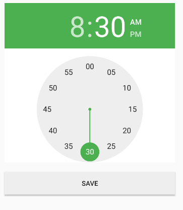
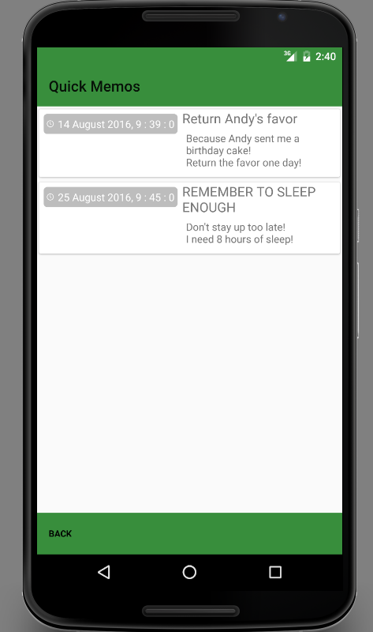
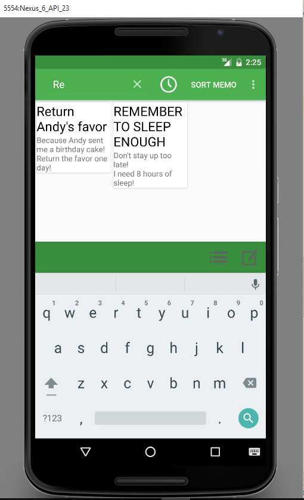
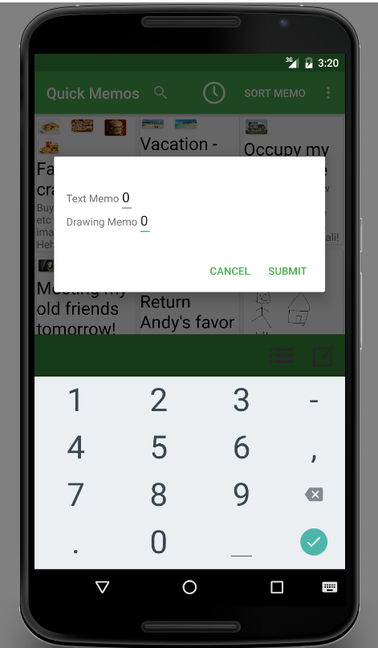
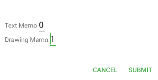
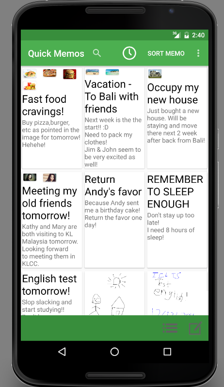

# MemoApp-Sunway-SEG2202

Quick Memo is a note-taking mobile application system developed as part of the university's assignment requirement of developing Android apps.
 
 <b>Main screen : </b>
  

    

Quick Memo supports basic functionalities such as adding,editing,and deleting memo notes and optional functionalities such as reminder features.
Notes are currently available in 2 types ; text notes and drawing notes.

<b> Text memo (left) and Drawing Memo (right) </b>

    
     

In text notes, users use in-built keyboards to type information and are allowed to upload any amount of images to the memo.
In drawing notes, users draw to the canvas.
For each and every memo notes, users can optionally set a reminder to notify users at a specific date and time.

<b> Reminder - Select date (left), select time (middle), and show reminder list(right) </b>

     
     
     

Other features such as searching memo by title name and sorting memo by types are available for users as well.

<b>Search feature</b>

 

Sorting memo types function depending on the number value provided. Smaller value will ensure the applied type will appear before type of higher value.

<b>Sort feature - Initial sort (left), Implement sort (center), Sort result (right)</b>

 
 
 

